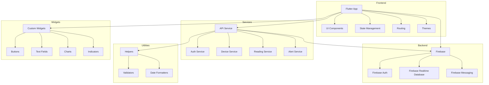

    

    <b>Automatic Architecture Diagrams from Code</b> 
    <a href="https://github.com/swark-io/swark">GitHub</a> • <a href="https://swark.io">Website</a> • <a href="mailto:contact@swark.io">Contact Us</a>

## Usage Instructions

1. **Render the Diagram**: Use the links below to open it in Mermaid Live Editor, or install the [Mermaid Support](https://marketplace.visualstudio.com/items?itemName=bierner.markdown-mermaid) extension.
2. **Recommended Model**: If available for you, use `claude-3.5-sonnet` [language model](vscode://settings/swark.languageModel). It can process more files and generates better diagrams.
3. **Iterate for Best Results**: Language models are non-deterministic. Generate the diagram multiple times and choose the best result.

## Generated Content
**Model**: GPT-4o - [Change Model](vscode://settings/swark.languageModel)  
**Mermaid Live Editor**: [View](https://mermaid.live/view#pako:eNp1k01u2zAQha9CcJ1cwIsCslU1dus6le10McpiIk4kohIpUMOiRZC7l_qzoNjdDd8bPX4kR28yt4rkSmamcNiU4hRnRojWvwzLxFnDZFQnChFBUnlmciJqmudRE_f3n8QazluxsXVjDRluF94GjoxMYo8GC6qDv7BjSK1nbYqF-hlOZegdknqABdca818XrAQS7egFWxojkj7iy0UWkedy4T3MXkpYsa5JxMh4FbKdG_fUtlhMoNdMR3K_dU7t8PkOosftpI2Ruz7yK3Q4N61vEFMn3jT3EFBV2P-m-x2iihwvvGvGM-tKs54gD_BAVUNuerBDH_UIT1hphWw_GD8g7h4ysa7Gbgz-9zo_tSqIxz1S2PiWbT2pY2LaJx5hHQbKmqV6ghP9YZFoqtTSOcOmRPch5Am2Rul85r0QDbOUzOVuLtOu3M0NQ3nIjLyTNYUTahX-i7dMcjeImVyJTCp6RV9xJt9Dk2_CFVGsMRy6lit2nu4kerbHvyaf1s76opSrV6xaev8HD9gSeA) | [Edit](https://mermaid.live/edit#pako:eNp1k01u2zAQha9CcJ1cwIsCslU1dus6le10McpiIk4kohIpUMOiRZC7l_qzoNjdDd8bPX4kR28yt4rkSmamcNiU4hRnRojWvwzLxFnDZFQnChFBUnlmciJqmudRE_f3n8QazluxsXVjDRluF94GjoxMYo8GC6qDv7BjSK1nbYqF-hlOZegdknqABdca818XrAQS7egFWxojkj7iy0UWkedy4T3MXkpYsa5JxMh4FbKdG_fUtlhMoNdMR3K_dU7t8PkOosftpI2Ruz7yK3Q4N61vEFMn3jT3EFBV2P-m-x2iihwvvGvGM-tKs54gD_BAVUNuerBDH_UIT1hphWw_GD8g7h4ysa7Gbgz-9zo_tSqIxz1S2PiWbT2pY2LaJx5hHQbKmqV6ghP9YZFoqtTSOcOmRPch5Am2Rul85r0QDbOUzOVuLtOu3M0NQ3nIjLyTNYUTahX-i7dMcjeImVyJTCp6RV9xJt9Dk2_CFVGsMRy6lit2nu4kerbHvyaf1s76opSrV6xaev8HD9gSeA)

